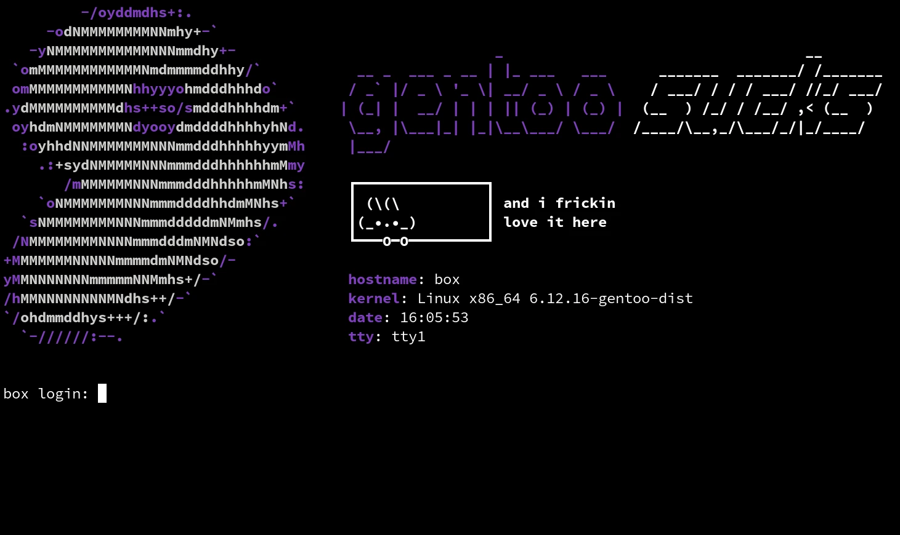

# etc-issuer

On Linux startup, if you don't use a splash screen,
`/sbin/agetty` will display the contents of `/etc/issue`
on your text console prior to login.<sup>[Read about it on ArchWiki](https://wiki.archlinux.org/title/Getty)</sup>

This project is a framework for making and managing ASCII/CP437/ANSI text art for `/etc/issue`.

For example, I rock:



## features

* Watch a file and autopreview its agetty output as you edit it
* Tutorials and reference sheets in [`howto/`](howto/README.md)
* Example text art to try out and download

## usage

Install a theme,

```bash
./install.sh art/$THEME_NAME_HERE
```

or test a theme,

```bash
./test art/$THEME_NAME_HERE
```

or view my reference sheets.

```bash
./test howto/$00TUTORIAL_NAME_HERE
```
